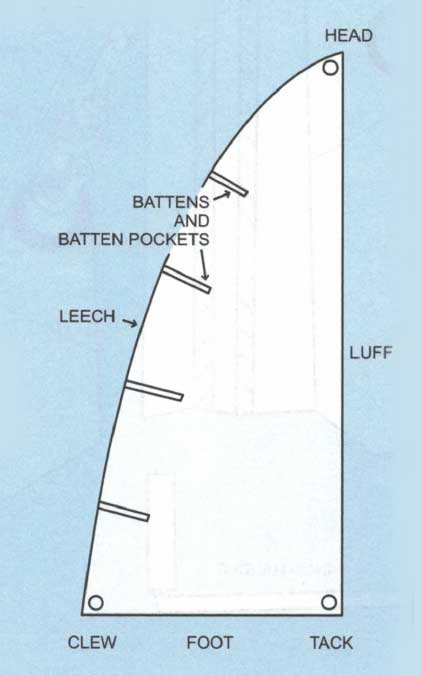

**Front:**
Назовите основные части паруса

**Back:**

Основные части паруса:

<ol>
  <li>Фаловый угол (Head) - верхний угол паруса</li>
  <li>Галсовый угол (Tack) - передний нижний угол</li>
  <li>Шкотовый угол (Clew) - задний нижний угол</li>
  <li>Передняя шкаторина (Luff) - передняя кромка паруса</li>
  <li>Нижняя шкаторина (Foot) - нижняя кромка паруса</li>
  <li>Задняя шкаторина (Leech) - задняя кромка паруса</li>
  <li>Латы (Battens) - пластиковые планки для поддержания формы паруса</li>
  <li>Риф-банты (Reef points) - точки крепления для уменьшения площади паруса</li>
</ol>

[[01-Sailing-deck]]
[[Sailing]]